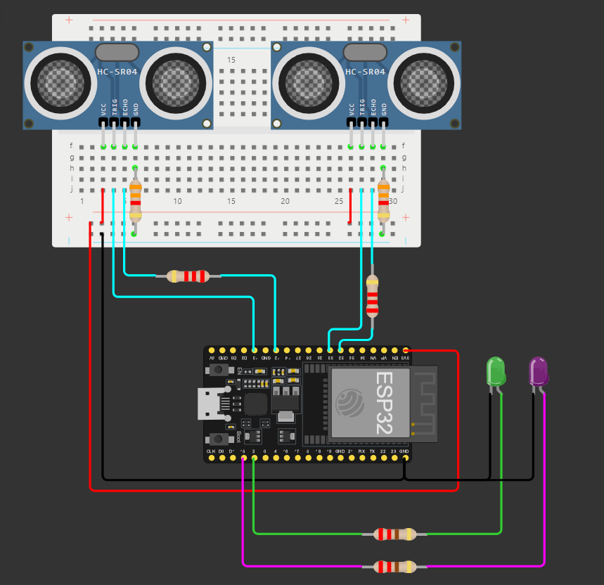
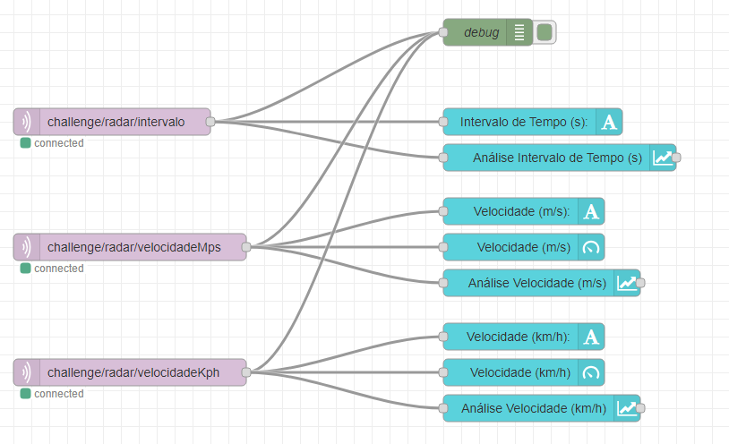
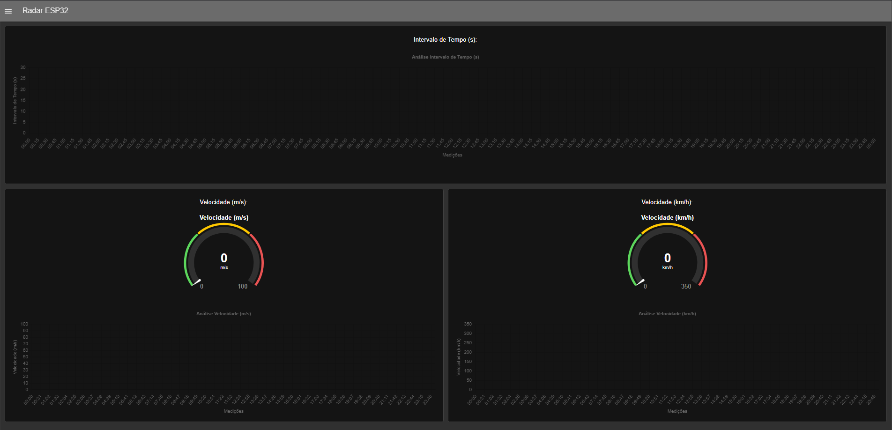
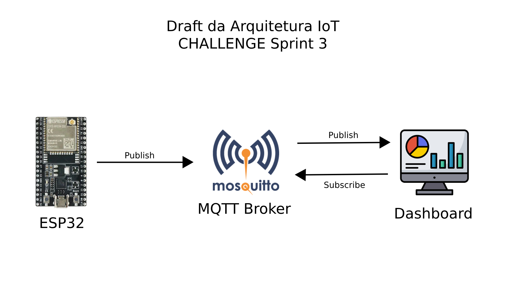

# 🏎️ CHALLENGE Mahindra Sprint 3

[Projeto no Wokwi](https://wokwi.com/projects/410221919973964801)

[Video de Explicação](https://youtu.be/oCPU1WJsFvY)

## 🤖 Edge Computing & Computer Systems

Entrega da matéria Edge Computing & Computer Systems para CHALLENGE Mahindra Sprint 3.

## 👥 Integrantes

- RM: 556785 // Carlos Eduardo dos Santos Ribeiro Filho
- RM: 555530 // Djalma Moreira de Andrade Filho
- RM: 558447 // Felipe Paes de Barros Muller Carioba
- RM: 556506 // Nicolas Caciolato Reis
- RM: 554736 // Rafael Federici de Oliveira

## 📕 Sobre o Projeto

### ✨ Visão Geral do Projeto

Este projeto refere-se ao site desenvolvido com o objetivo de popularizar e mostrar, de melhor forma, o que é a Fórmula-E no Brasil. A percepção de que a Fórmula-E é apenas uma divisão secundária da Fórmula 1 deve deixar de existir e, é com este pensamento, que desenvolvemos nosso site para uma percepção mais agradável do público em relação ao esporte de automobilismo elétrico fórmula. Focamos em não desvincular totalmente a fórmula E dos veículos à combustão, mas sim, mostrar as semelhanças e comparações sutis entre ambos. (Inclusive, tal ato pode ser visto na propaganda do EP de Tokyo de 2024, que chamaram Sung Kang, ator do Han, de Velozes e Furiosos, para gravar um comercial com diversos veículos à combustão personalizados e customizados. Tal propaganda possuía o intuito de promover a Fórmula E com sua estética e vincular a Fórmula E com corridas de rua). Utilizaremos de um site intuitivo, customizável e imersivo para um melhor agrado do usuário. Com isto, traremos comparações com a Fórmula 1 sobre estatísticas, tempo de volta, velocidade, entre outros. Decidimos que, focar em estética, vínculo com corridas em cenários de rua, tecnologia e acessibilidade, seria o ideal para a popularização da Fórmula E no Brasil, visto que, o brasileiro se interessa por esses quatro pontos.

### 🤖 Visão Geral em Edge Computing & Computer Systems

Este projeto consiste em um radar de velocidade, que será utilizado para medir a velocidade de um corpo ao passar por um ponto inicial até chegar a um ponto final, com o intuito de colher dados de corridas e treinos da Fórmula-E para usa-los em nosso site.

### 🖼️ Prints do Projeto

- Circuito:
</img>

- Fluxo Node-RED:
</img>

- Dashboard Node-RED:
</img>

## 💡 Draft da Arquitetura

</img>

## 🔨 Ferramentas

- [ESP32](https://espressif-docs.readthedocs-hosted.com/projects/arduino-esp32/en/latest/index.html)
- [Linguagem Arduino](https://www.arduino.cc/reference/pt/)
- [C++](https://learn.microsoft.com/pt-br/cpp/?view=msvc-170)
- [Node-RED](https://nodered.org/docs/)
- [MQTT Broker Mosquitto](https://mosquitto.org/man/mqtt-7.html)


## 🖥️ Requisitos e Componentes

### 🔧 Requisitos

- Simulador: [Wokwi](https://wokwi.com/)
- IDE: [ArduinoIDE](https://www.arduino.cc/en/software)

### 📚 Bibliotecas Utilizadas:

``` c++
#include <ArduinoJson.h>
#include <WiFi.h>
#include <PubSubClient.h>
```

### 📄 Componentes Utilizados

- [ESP32:](https://docs.wokwi.com/pt-BR/guides/esp32) Controlar os demais componentes.
- 2x [Sensores de Distância Ultrassônico HC-SR04:](https://docs.wokwi.com/pt-BR/parts/wokwi-hc-sr04) Iniciar as medições da velocidade (Ponto inicial e Ponto final).
- 2x [LEDs:](https://docs.wokwi.com/pt-BR/parts/wokwi-led) Feedback visual da conexão ao WiFi e MQTT.
- 6x [Resistores:](https://docs.wokwi.com/pt-BR/parts/wokwi-resistor) Conversão para a voltagem adequada de cada um dos componentes.

### 🔌 Conexões dos Componentes

- Ligue o GND e 3.3V do [ESP32](https://docs.wokwi.com/pt-BR/guides/esp32) em seus respectivos pinos de cada componente (GND e VCC).
- 1º [Sensor de Distância Ultrassônico HC-SR04:](https://docs.wokwi.com/pt-BR/parts/wokwi-hc-sr04) Entradas digitais 13 e 12 do ESP32, respectivamente para os pinos trigger e echo.
- 2º [Sensor de Distância Ultrassônico HC-SR04:](https://docs.wokwi.com/pt-BR/parts/wokwi-hc-sr04) Entradas digitais 33 e 32 do ESP32, respectivamente para os pinos trigger e echo.

(Obs: para os pinos echo e GND dos Sensores de Distância Ultrassônico HC-SR04, utilize respectivamente resistores de 2.2KΩ e 3.3KΩ)

- [LED Verde:](https://docs.wokwi.com/pt-BR/parts/wokwi-led) Entrada digital 2 do ESP32 (utilize um resistor de 220Ω).
- [LED Roxo:](https://docs.wokwi.com/pt-BR/parts/wokwi-led) Entrada digital 15 do ESP32 (utilize um resistor de 220Ω).

## 📒 Instruções de Uso

### 🖥️ Simulador

- Abrir o [Projeto no Wokwi](https://wokwi.com/projects/410221919973964801).
- Iniciar a simulação no botão 'Start the simulation'.
- Aguardar a conexão ao WiFi e ao Borker MQTT.
- Altere os valores dos [Sensores de Distância Ultrassônico](https://docs.wokwi.com/pt-BR/parts/wokwi-hc-sr04), para iniciar a medição da velocidade.
- Abrir o [Node-RED](https://nodered.org/docs/) localmente em seu dispositivo.
- Carregar o arquivo .json do fluxo para o [Node-RED](https://nodered.org/docs/).
- Estabelecer a conexão com o [Node-RED](https://nodered.org/docs/).
- Observar os dados apresentados no Dashboard do [Node-RED](https://nodered.org/docs/).

### 🖥️ ArduinoIDE

- Monte o circuito em uma placa [ESP32](https://docs.wokwi.com/pt-BR/guides/esp32), conectando cada pino dos componentes em suas respectivas entradas.
- Carregue o código deste repositório através do [ArduinoIDE](https://www.arduino.cc/en/software).
- Altere os valores dos [Sensores de Distância Ultrassônico](https://docs.wokwi.com/pt-BR/parts/wokwi-hc-sr04), para iniciar a medição da velocidade.
- Abrir o [Node-RED](https://nodered.org/docs/) localmente em seu dispositivo.
- Carregar o arquivo .json do fluxo para o [Node-RED](https://nodered.org/docs/).
- Estabelecer a conexão com o [Node-RED](https://nodered.org/docs/).
- Observar os dados apresentados no Dashboard do [Node-RED](https://nodered.org/docs/).